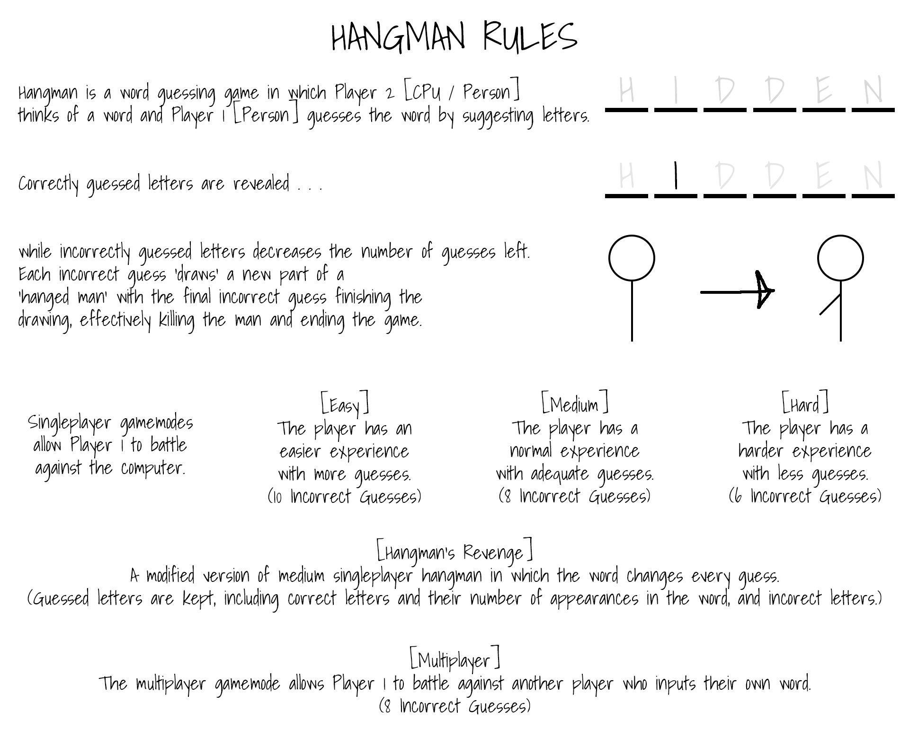

# Hangman's Revenge
A variation of the popular paper and pencil guessing game "Hangman". Hangman's Revenge twists the target word every guess, keeping guessed letters, including correct letters and their number of appearances, and incorrect letters. This project was written in MATLAB.

## Playing The Game
This project was written in MATLAB and is played using the command line. To run the game, hangman is the main file:
> hangman

## Rules

